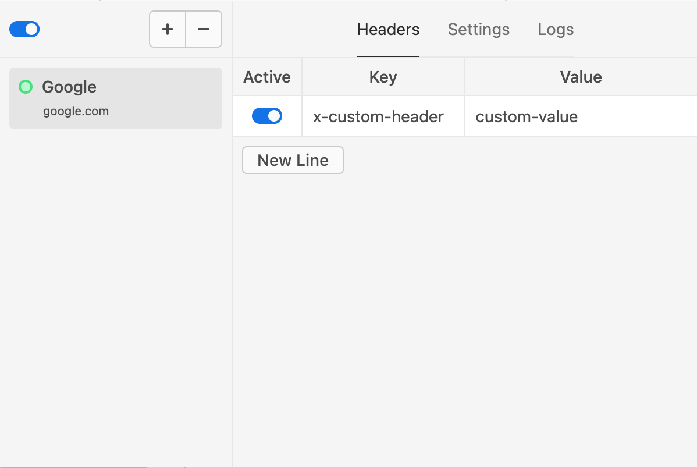
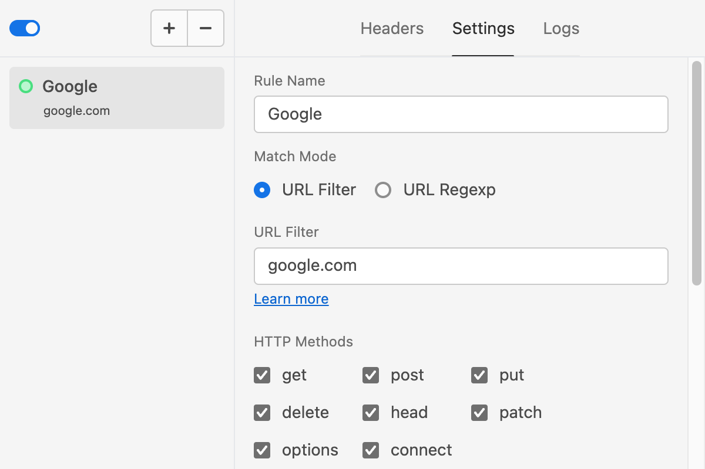

  </img>

<h1 align="center">Simple Header Modifier</h1>

A lightweight chrome extension that allows you to easily add custom headers to requests. 

    </img>
    </img>

## Install

- [Download](https://github.com/myWsq/simple-header-modifier/releases) the last version zip file and unzip it to a folder.

- Open `chrome://extensions` and turn on the **Developer mode** in top right.

- Click the **Load unpacked extension** button and select the unzipped folder to install it.

- Enjoy it!

## Note 

Simple Header Modifier modified your request headers and get feedback through the [declarativeNetRequest API](https://developer.chrome.com/docs/extensions/reference/declarativeNetRequest). However, the [`onRuleMatchedDebug`](https://developer.chrome.com/docs/extensions/reference/declarativeNetRequest/#event-onRuleMatchedDebug) method is only available for unpacked extensions. This is the reason why this extension cannot be installed by store.

## License

MIT License Copyright (c) 2022 Shuaiqi Wang
